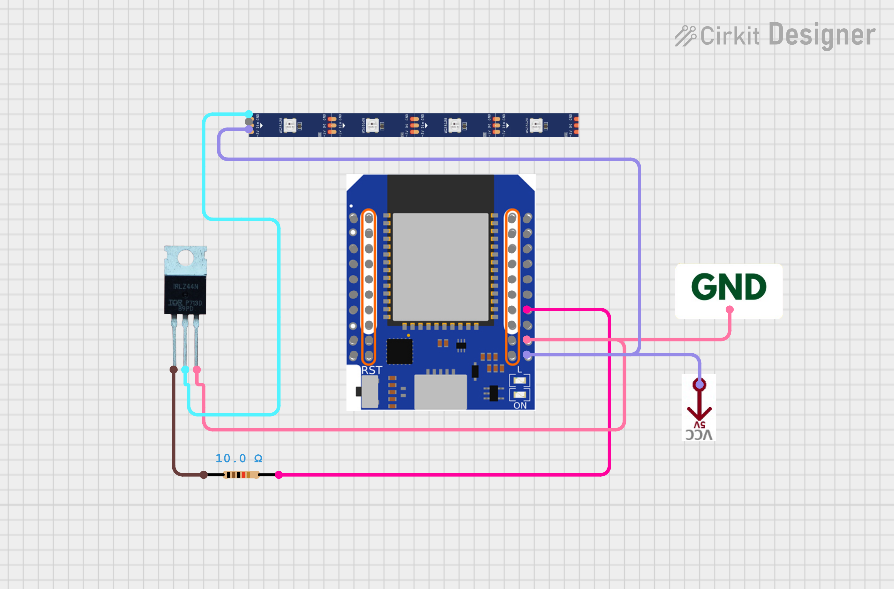

# Smart Staircase Lighting

DIY staircase lighting with capacitive touch detection and Home Assistant integration. Touch the handrail → lights fade in. Walk away → lights fade out. All settings tunable live via HA sliders.



---

## How It Works

1. Copper tape runs along the underside of the handrail, wired to **GPIO1** on the ESP32-S2 Mini as a capacitive touch sensor.
2. Touch triggers `handle_stair_timer` — a configurable filter-on delay confirms it's a real touch (not noise).
3. **GPIO18** drives an **IRLZ44N MOSFET** via PWM, which powers a **COB LED strip** with a smooth 1-second fade-in.
4. After the configured duration, lights fade out over 4 seconds.
5. Touching again during the timer restarts it (script `mode: restart`).

The COB strip gives a seamless "dot-less" glow. All wiring is routed internally through the wall with low-profile silicone grommets — hardware stays invisible.

---

## Hardware

| Component | Details |
| --- | --- |
| MCU | Wemos S2 Mini (ESP32-S2) |
| MOSFET | IRLZ44N (logic-level, TO-220) |
| LED Strip | COB (chip-on-board), single color |
| Touch Sensor | Copper tape on handrail → GPIO1 |
| PWM Output | GPIO18 → MOSFET gate |
| PCB | Custom KiCad design (see `hardware/kicad/`) |


---

## Firmware

Built with [ESPHome](https://esphome.io). No custom C++ — pure YAML.

### Flash

```bash
# Install ESPHome if needed
pip install esphome

# Add WiFi credentials
cp firmware/secrets.yaml.example firmware/secrets.yaml
# edit firmware/secrets.yaml with your SSID and password

# Flash
esphome run firmware/stairlights.yaml
```

`secrets.yaml` format:

```yaml
wifi_ssid: "YourNetwork"
wifi_password: "YourPassword"
```

After first flash, OTA updates work over WiFi — no USB needed.

---

## Home Assistant Controls

Once the ESPHome integration is added in HA, five sliders appear:

| Slider | Range | Default | Purpose |
| --- | --- | --- | --- |
| **Light Duration** | 5–120 s | 30 s | How long lights stay on after touch |
| **LED Brightness** | 10–100 % | 100 % | Peak brightness at fade-in |
| **Touch Threshold** | 1,000–300,000 | 50,000 | Capacitive trigger level — tune for your handrail |
| **Touch Filter On** | 0–100 ms | 8 ms | Debounce delay before turning on (rejects noise) |
| **Touch Filter Off** | 0–100 ms | 50 ms | Extra hang time before starting fade-out |

**Calibrating touch sensitivity:** Start with Touch Threshold at 50,000. Watch the `Staircase Touch Pad` binary sensor in HA. Raise the threshold if lights trigger from ambient noise/humidity; lower it if touches aren't registering.

---

## Wiring

See `docs/schematic.png` for the full Cirkit Designer diagram. Key connections:

```text
ESP32-S2 GPIO18  →  IRLZ44N Gate (via 10Ω resistor)
IRLZ44N Drain   →  LED Strip negative
LED Strip +     →  12V supply
IRLZ44N Source  →  GND
ESP32-S2 GPIO1  →  Copper tape (touch sensor)
ESP32-S2 GND   →  GND
ESP32-S2 3.3V  →  (internal, no external connection needed)
```

---

## File Structure

```text
stair-lights/
├── firmware/
│   └── stairlights.yaml        # ESPHome configuration
├── hardware/
│   ├── kicad/                  # KiCad schematic and PCB layout
│   │   ├── StairLights.kicad_pcb
│   │   ├── StairLights.kicad_pro
│   │   ├── StairLights.kicad_prl
│   │   └── StairLights.kicad_sch
│   ├── gerbers/
│   │   └── StairLights.kicad_pcb.zip   # Fabrication-ready Gerbers
│   └── stairs-pcb.step         # 3D model
└── docs/
    ├── schematic.png            # Wiring diagram
    ├── esp32-s2-mini-front.png  # MCU reference photo
    └── esp32-s2-mini-back.png   # MCU pinout
```

---

## Troubleshooting

**Lights trigger randomly** — Capacitive drift from humidity or power fluctuations. Raise Touch Threshold or increase Touch Filter On delay.

**Touch not registering** — Lower Touch Threshold. Ensure copper tape has good contact with the GPIO1 wire.

**Fallback AP** — If WiFi is unreachable, the ESP32 broadcasts `Stairlights Fallback Hotspot`. Connect to it and navigate to `192.168.4.1` to reconfigure.

**OTA fails** — Make sure `secrets.yaml` OTA password matches what was flashed. Default is in the YAML.
